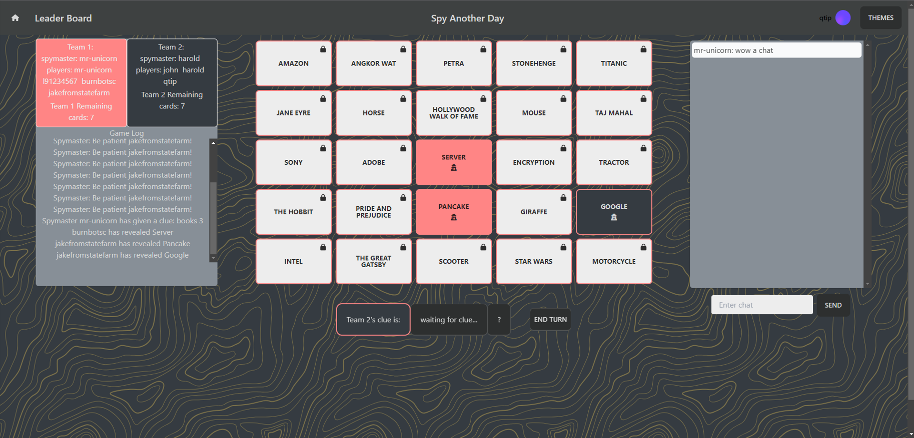
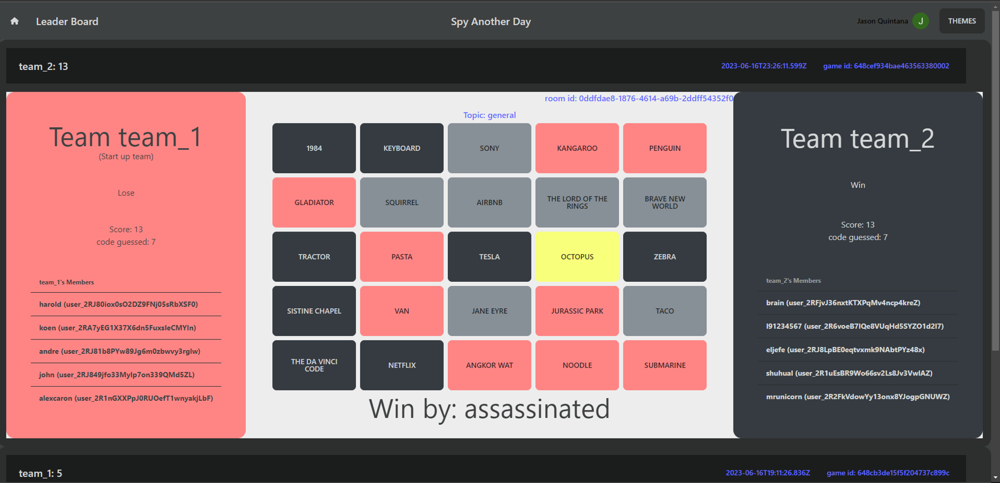
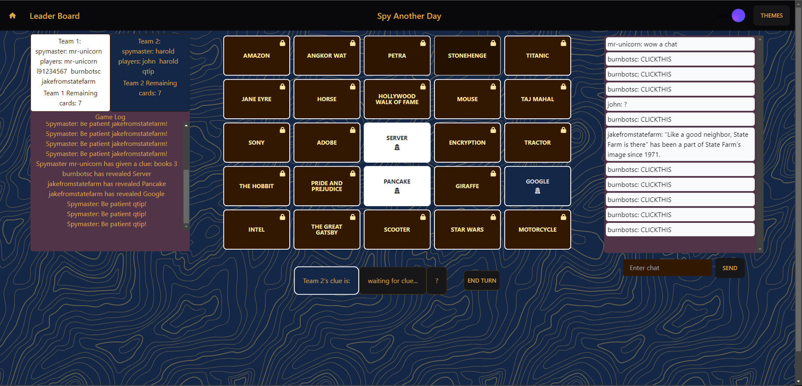
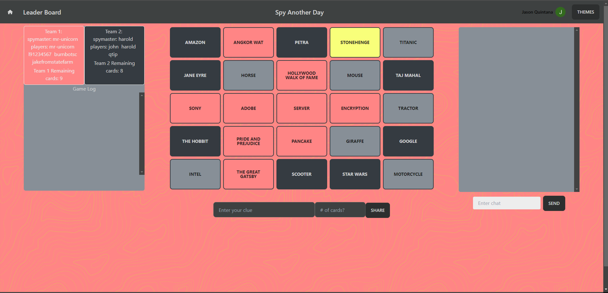
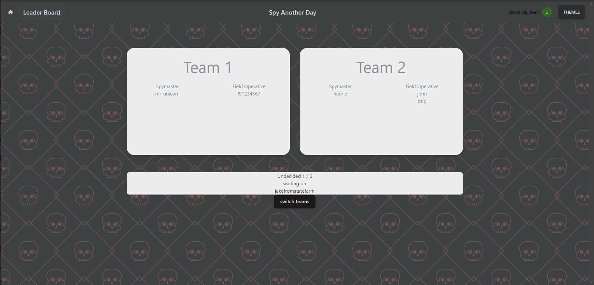

# Spy Another Day

Spy Another Day is an interactive online multiplayer game where players work together in teams to uncover hidden cards based on clues provided by their designated Spy Master. This README provides an overview of the game's features, instructions on how to play, and steps to install and deploy the game.

## Features

- Real-time chat and game interactions using Socket.IO.
- Fast game log and game state updates using Redis.


- Stored game history in a MongoDB database, accessible through the leaderboard.

- Responsive game board that updates dynamically based on the current turn and revealed cards.
- Multiple themes available


## How to Play

### Spy Master

As a Spy Master, your goal is to guide your field operatives to uncover all the cards belonging to your team. Here's how you play:

1. Study the cards that belong to your team when it's your team's turn.
2. Think of a single word clue that can connect multiple cards.
3. Give a number indicating how many cards the clue relates to.
4. Communicate the clue and the number to your team.



For example, you could say "books" as the clue with a count of 2. Your team might then select "The Great Gatsby" and "Pride and Prejudice" as the cards associated with the clue.

### Field Operative

As a Field Operative, your goal is to use the clues provided by the Spy Master to identify the cards belonging to your team. Here's how you play:

1. Listen to the clue and the number given by the Spy Master.
2. Click the word on a card to tell your team that you think this is a possible card.
3. Use the lock icon in the top right corner of a card to lock in your selection.
4. If the card is neutral, your turn ends.
5. If the card belongs to the other team, it becomes their turn.
6. If the card is the assassin card, the game ends.
7. If the card belongs to your team, you can select another card.


## Installation

Before starting the game, make sure you have the following prerequisites installed:

- Redis: [Installation Guide](https://redis.io/docs/getting-started/installation/)
- MongoDB: [Installation Guide](https://www.mongodb.com/docs/manual/installation/)
- Clerk API Key: Obtain your ###publishable API key from [clerk.com](https://clerk.com)

To deploy and host the game locally, follow these steps:

1. Clone the repository to your computer.
2. Change to the `client` directory: `cd client`
3. Install the required dependencies: `npm install`
4. Create a `.env` file in the root of the `client` directory with the following content:

```javascript
VITE_SERVER_URL="http://localhost:3000" # or your deployed IP/URL
VITE_REACT_APP_CLERK_PUBLISHABLE_KEY="YOUR KEY GOES HERE"
```
5. Save the `.env` file.
6. Build the client: `npm run build`
7. Go back to the root of the repository: `cd ..`
8. Change to the `server` directory: `cd server`
9. Install the required dependencies: `npm install`
10. Ensure that both Redis and MongoDB are running on your computer.
11. Start the server: `npm run dev`

The game should now be ready to play.

## Get Started

To start playing Spy Another Day, follow these steps:

1. Create an account and verify your email.
2. Create a room within



## API Endpoints
### User Endpoints
|    Type        |Endpoints                      |description                 |
|----------------|-------------------------------|-----------------------------|
|GET             |/user/:username                | retreives user infomation |
|POST            |/user                          | create an user          |
|PATCH          |/nickname                       |change user nickname|
|PATCH          |/password                       |change user password|


### **GET** */user/:username*
#### Parameters:
|    Parameter        |type                      |description                 |
|----------------|-------------------------------|-----------------------------|
|username             |string                | Required username to identify which user data to send |

#### Response:
```
{
    "_id": "6484cea799824c4a16b529ec",
    "username": "test1",
    "nickname": "admin1",
    "email": "123@test.com",
    "password": "password123123",
    "__v": 0
 }
```
### **POST** */user*
#### Body Parameters:
|    Parameter        |type                      |description                 |
|----------------|-------------------------------|-----------------------------|
|username             |string                | Required username for create a user |
|nickname             |string                | Required nickname for create a user |
|password             |string                | Required password for create a user |
|email             |string                | Optional for create a user email|
|salt             |string                | Optional for create a user password |


#### Response:
`
201 user created
`
### **PATCH** */nickname*
#### Body Parameters:
|    Parameter        |type                      |description                 |
|----------------|-------------------------------|-----------------------------|
|username             |string                | Required username for identify a user |
|nickname             |string                | Required nickname for update the nickname|

#### Response:
`
200 nickname updated
`
### **PATCH** */password*
#### Body Parameters:
|    Parameter        |type                      |description                 |
|----------------|-------------------------------|-----------------------------|
|username             |string                | Required username for identify a user |
|password             |string                | Required password for update the password|

#### Response:
`
200 password updated
`

### Words Endpoints
|    Type        |Endpoints                      |description                 |
|----------------|-------------------------------|-----------------------------|
|GET             |/topics                | retreives all topics |
|GET            |/allTopicWords                          | retreives all topics and words associate with it        |
|GET          |/words/:topic                       |retreives words for a specific topic|
|GET          |/initGame/:topic                       |retreives words in 2d array with inital game setups|
|POST          |/newTopic                       |create a new topic and words associate with it|
|PATCH          |/addNewWords                       |add new words to a exsited topic|

### **GET** */topics*
#### Parameters:
`none`

#### Response:
```
[
    {
        "_id": "6484cc729fdb0cbcd02d9d93",
        "topic": "Technology"
    },
    ...
]
```

### **GET** */allTopicWords*
#### Parameters:
`none`

#### Response:
```
[
    {
        "_id": "6484cc729fdb0cbcd02d9d93",
        "topic": "Technology",
        "words": [
            "Algorithm",
            "Analytics",
            "API",
            "Artificial Intelligence",
            "Automation",
            "Big Data",
            "Blockchain",
            "Cloud Computing",
            "Machine Learning",
            "Mobile",
            "Network",
           ...
        ],
        "__v": 0
    },
    ...
]

```

### **GET** */words/:topic*
#### Parameters:
|    Parameter        |type                      |description                 |
|----------------|-------------------------------|-----------------------------|
|topic            |string                | Required topic to identify which topic data to send |

#### Response:
```
{
    "_id": "6484cc729fdb0cbcd02d9d93",
    "topic": "Technology",
    "words": [
        "Algorithm",
        "Analytics",
        "API",
        "Artificial Intelligence",
        "Automation",
        "Big Data",
        ...
    ],
    "__v": 0
}
```

### **GET** */initGame/:topic*
#### Parameters:
|    Parameter        |type                      |description                 |
|----------------|-------------------------------|-----------------------------|
|topic            |string                | Required topic to identify which topic data to send |

#### Query Parameters:
|    Parameter        |type                      |description                 |
|----------------|-------------------------------|-----------------------------|
|cards            |integer                | Optional total number of cards, default 25 |
|assassins            |integer                | Optional total number of assassin cards, default 1 |
|agents            |integer                | Optional total number of agents per team, default 8 |

#### Response:
```
{
    "topic": "Technology",
    "team_1_guessed": 0,
    "team_2_guessed": 0,
    "team_1_guess_goal": 8,
    "team_2_guess_goal": 9,
    "team_1_members": {},
    "team_2_members": {},
    "team_1_spymaster": "",
    "team_2_spymaster": "",
    "players": {},
    "startUpTeam": "team_2",
    "currentTeam": "team_2",
    "words": [
        [
            {
                "word": "Data Science",
                "belongsTo": "bystander",
                "isTouched": false
            },
            {
                "word": "Firmware",
                "belongsTo": "bystander",
                "isTouched": false
            },
            {
                "word": "Network",
                "belongsTo": "0",
                "isTouched": false
            },
            ...
        ],
        ...
    ]
}

```

### **POST** */newTopic*
#### Body Parameters:
|    Parameter        |type                      |description                 |
|----------------|-------------------------------|-----------------------------|
|topic            |string                | Required topic for create a topic with words associate with it |
|words             |array of strings                | Required words for create a topic with words associate with it |


#### Response:
`
201 topic created
`

### **PUT** */addNewWords*
#### Body Parameters:
|    Parameter        |type                      |description                 |
|----------------|-------------------------------|-----------------------------|
|topic            |string                | Required topic for identify a topic to add new words to it |
|words             |array of strings                | Required words to add new words to the topic |


#### Response:
`
200 words added
`


### Group Endpoints
|    Type        |Endpoints                      |description                 |
|----------------|-------------------------------|-----------------------------|
|GET             |/groups                | retreives all groups information|
|GET            |/group/:groupName                          | retreives a specific group information  |
|POST          |/group                       |create a new group associate with its members|
|PUT          |/groupMember                       |add new members to a group|
|PATCH          |/groupName                       |update group name|
|DELETE          |/groupMember                       |delete one group member|
|DELETE         |/group/:groupName                       |delte a group|


### **GET** */groups*
#### Parameters:
`none`

#### Response:
```
[
    {
        "_id": "6484faf9032fdf604cd22a5b",
        "groupName": "group1",
        "groupMembers": [
            "member1",
            "member2"
        ],
        "__v": 0
    },
    ...
]
```

### **GET** */group/:groupName*
#### Parameters:
|    Parameter        |type                      |description                 |
|----------------|-------------------------------|-----------------------------|
|groupName            |string                | Required group name to identify which group data to send |

#### Response:
```
{
    "_id": "6484faf9032fdf604cd22a5b",
    "groupName": "group1",
    "groupMembers": [
        "member1",
        "member2"
    ],
    "__v": 0
}
```

### **POST** */group*
#### Body Parameters:
|    Parameter        |type                      |description                 |
|----------------|-------------------------------|-----------------------------|
|groupName            |string                | Required group name for create a group with members associate with it, groupName needs to be unique |
|groupMembers             |array of strings                | Required members for create a group with members associate with it |


#### Response:
`
201 group created
`

### **PUT** */groupMember*
#### Body Parameters:
|    Parameter        |type                      |description                 |
|----------------|-------------------------------|-----------------------------|
|groupName            |string                | Required group name for identify which group to add the new members |
|groupMembers             |array of strings                | Required members for join a group |


#### Response:
`
200 member added
`

### **PATCH** */groupName*
#### Body Parameters:
|    Parameter        |type                      |description                 |
|----------------|-------------------------------|-----------------------------|
|currentGroupName            |string                | Required current group name for identify which group to change the name |
|changeToGroupName             |string              | Required new group name to change the group name|


#### Response:
`
200 group name updated
`

### **DELETE** */groupMember*
#### Body Parameters:
|    Parameter        |type                      |description                 |
|----------------|-------------------------------|-----------------------------|
|groupName            |string                | Required group name for identify which group to delete a member|
|groupMember             |string              | Required one member to indecate who to delete|


#### Response:
`
200 member deleted
`

### **DELETE** */group/:groupName*
#### Parameters:
|    Parameter        |type                      |description                 |
|----------------|-------------------------------|-----------------------------|
|groupName            |string                | Required group name for identify which group to delete |


#### Response:
`
200 group deleted
`

### History Endpoints
|    Type        |Endpoints                      |description                 |
|----------------|-------------------------------|-----------------------------|
|GET             |/history                | retreives match history by descending order|
|POST            |/history                          | create a new match history  |

### **GET** */history*
#### Query Parameters:
|    Parameter        |type                      |description                 |
|----------------|-------------------------------|-----------------------------|
|limit            |number                | Optional limit for how many data sent back, default 30 |

#### Response:
```
[
    {
        "_id": "648a08efd67ba52f546300a4",
        "topic": "Technology",
        "roomID": "433231",
        "team_1": "cat",
        "team_2": "dog",
        "team_1_spymaster": "Bengal",
        "team_2_spymaster": "Bulldog",
        "team_1_members": ["Maine Coon", "Siamese", "Persian", "Bengal"],
        "team_2_members": ["Labrador Retriever", "German Shepherd", "Golden Retriever", "Bulldog"],
        "words": [
            [
                {
                    "word": "Robotic Process Automation",
                    "belongsTo": "team_1",
                    "isTouched": false
                },
                ...
            ]
            ...
        ],
        "team_1_guessed": 0,
        "team_2_guessed": 0,
        "team_1_guess_goal": 8,
        "team_2_guess_goal": 9,
        "startUpTeam": "team_2",
        "teamWon": "team_1",
        "team_1_score": 0,
        "team_2_score": 0,
        "winReason": "assassin",
        "createdAt": "2023-06-14T15:48:41.312Z",
        "updatedAt": "2023-06-14T15:48:41.312Z",
        "__v": 0
    },
    ...
]
```

### **POST** */history*
#### Body Parameters:
|    Parameter        |type                      |description                 |
|----------------|-------------------------------|-----------------------------|
|topic            |string                | Require topic to determine the game words style |
|roomID            |string                | Require Room ID to determine which room |
|teamWon            |string                | Require winning team name  |
|winReason            |string                | reason for why winning team won |
|startUpTeam            |string                | Require start up team name |
|team_1            |string                | Require team 1 name |
|team_2            |string                | Require team 2 name |
|team_1_guessed            |number                | Require number of cards that team 1 has guessed |
|team_2_guessed            |number                | Require number of cards that team 2 has guessed |
|team_1_members            |object                | Require all team 1 members |
|team_2_members            |object                | Require all team 2 members |
|team_1_spymaster            |string                | Require team 1 spymaster name |
|team_2_spymaster            |string                | Require team 2 spymaster name |
|team_1_score            |number                | team 1 final score |
|team_2_score            |number                | team 2 final score |
|words            |Array                | Require words in the game|

#### properties need to add to gameState before submit
```
    {
        teamWon: String,
        team_1_score: Number,
        team_2_score: Number,
        winReason: String,
    }
```

#### Response:
`
201 history created
`

